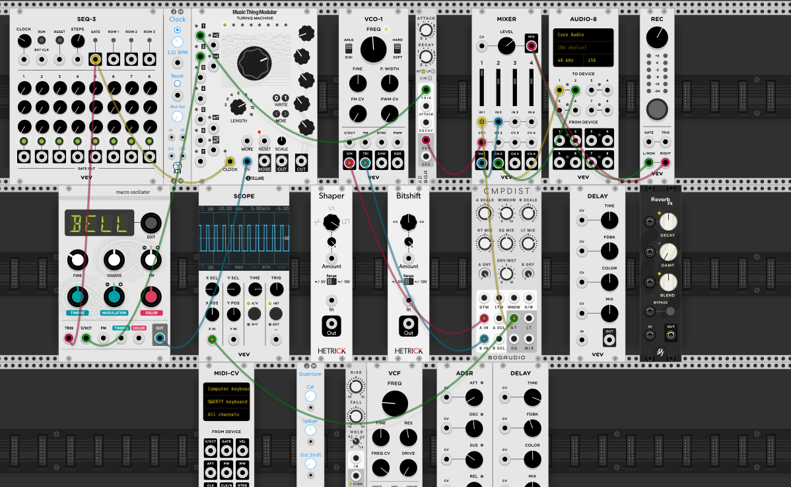

# VCV Rack Project Template

## How to Submit This Assignment

Before submitting your assignment, you need three files:

1. Save your .vcv file from VCV Rack and add it to this repo
2. Take a screenshot of your patch (using [Windows](https://support.microsoft.com/en-us/windows/use-snipping-tool-to-capture-screenshots-00246869-1843-655f-f220-97299b865f6b) or [Mac](https://support.apple.com/en-us/HT201361)) and add that .png file to this repo
3. Record a .wav audio file and [upload it](https://archive.org/create/) to the Internet Archive

Then, edit this README.md file:

1. In the **Screenshot** section, make sure the filename is correct
2. In the **Link to Sound File** section, replace the URL with yours (from step 3 above)
3. In the **Notes** section at the bottom, add any notes you want to include
4. Change the title at the top of the file to something descriptive of your project
5. Remove this **How to Submit** section

While I am known for being tone death and having no rhythm, I decided to embrace a techno more electric vibe for this final project...I am usually more of a country girl but hey we exploring new things. I decided to do my project based on my bitsy project, "What Comes Up, Must Come Down: A Project Powered by Adderall"

I started my sound very chaotic. Certain sounds playing in your left ear, others in your right ear, some playing in both all at once. This symbolizes well my brain not on adderall. Thoughts are going 90 mille per hour and can't focus well on one thing; thinking about breakfast, homewor--does my car need gas??? Why is that there? Then I am singing a song in my head that I haven't heard in 10 years... my head is quite exhausting. 

The middle of my song is more together with the same beats repeating. You can hear a light drum noise in the background, this to me is symbolizing my Adderall; to me drums are calming sometimes and that is what adderall does for me, it calms the thoughts, the anxiety, the randomness and allows me to focus on a task. The other noise you hear is a techno beat that symbolizes the work getting done, faster in areas, slower in others but pretty consistant.

The end of my sound, becomes gloomier... just like my comedowns. Adderall is great temporarily but the wear off is rough, mentally. For me, it is like staring a wall, feeling nothing at all. Nothing is good, nothing is bad, but a sudden negative thought and it gets darker. Anxiety piles in. So the ending of this sound is those feelings in a beat.

Overall, this project was for sure a learning experience, honestly before this I did not even know this kind of stuff existed. I used GarageBand to piece my sounds and beats together, which was another learning process. 

Thanks for the awesome semester.
Avery
## Screenshot

## Link to Sound File

https://archive.org/details/YOUR_IDENTIFIER

## Notes

